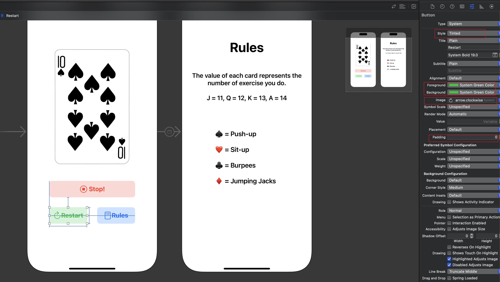

# Card Workout Game iOS app using UIKit via Storyboard or programmatic UI

## Description

This is a simple iOS app that allows users to play a card workout game. The app is built using UIKit and can be created using Storyboard or programmatic UI. The app displays a card with a workout exercise and the user has to perform the exercise for a certain amount of time.

## Screenshots

  
  

### Using Storyboard

  

### Using Programmatic UI

  

### Uing new Button from iOS 15 (configuration of the button)

  

## Acknowledgements

- [Sean Allen](seanallen.teachable.com)
